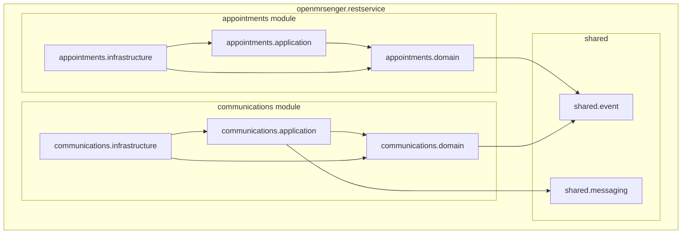
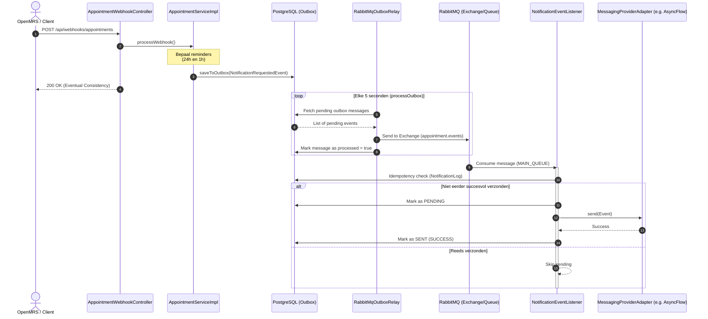
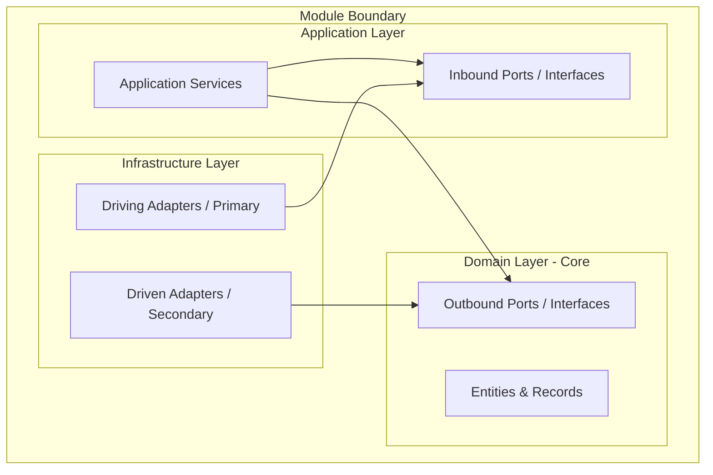

# OpenMRSenger - Architectuur Documentatie

Dit document beschrijft het architectonische ontwerp van de OpenMRSenger `rest-service` applicatie. Het systeem is gebouwd als een **Modular Monolith** en maakt binnen elke module gebruik van de **Hexagonal Architecture** (Ports and Adapters). Dit zorgt voor een sterke scheiding van verantwoordelijkheden en minimaliseert koppelingen tussen modules en externe frameworks.

---

## 1. Modular Monolith Structuur

De applicatie is opgedeeld in twee hoofdmodules en een gedeelde kern (`shared`):
1. **Appointments module**: Verantwoordelijk voor het ontvangen en valideren van afspraak-webhooks vanuit OpenMRS en het inplannen van herinneringen.
2. **Communications module**: Verantwoordelijk voor het verwerken van notificatieverzoeken en het daadwerkelijk versturen van berichten via verschillende externe messaging providers.
3. **Shared kern (`shared`)**: Bevat gedeelde componenten zoals credentials, gemeenschappelijke events (`DomainEvent`, `NotificationRequestedEvent`), en constanten voor RabbitMQ.



### Ontkoppeling en Grensoverschrijdingen
De `appointments` en `communications` modules zijn volledig van elkaar ontkoppeld. Ze delen **geen** database-tabellen en hebben geen directe klasse-koppelingen of synchrone method-calls naar elkaar. 

De enige manier van interactie is asynchroon via **Domain Events** die worden verzonden over **RabbitMQ**. Dit voorkomt dat een storing in de communicatie-infrastructuur (bijv. een offline sms-provider) de afspraakverwerking in de weg staat.

### Voordelen van deze Architectuur
- **Schaalbaarheid (Scalability)**: Omdat de modules functioneel en technisch gescheiden zijn, kan de `communications` module in de toekomst eenvoudig worden geëxtraheerd naar een aparte microservice als het notificatieverkeer sterk groeit.
- **Onderhoudbaarheid (Maintenance)**: Wijzigingen in de communicatielogica of het toevoegen van een nieuwe sms-provider hebben geen enkele invloed op de afsprakenlogica. Code boundaries worden streng gecontroleerd met behulp van ArchUnit tests (zie `HexagonalArchitectureTest`).
- **Multi-tenancy**: De scheiding maakt het mogelijk om per ziekenhuis (`hospitalId`) of provider verschillende configuraties te gebruiken zonder dat de kern-domeinmodellen hiervan weten.

---

## 2. Asynchrone Interactie & Transactional Outbox Pattern

Om betrouwbare berichtgeving te garanderen, wordt gebruikgemaakt van het **Transactional Outbox Pattern**. Dit patroon lost het probleem op waarbij een database-update slaagt, maar het publiceren van een event naar de message broker faalt (of vice versa).

### Flow Sequence Diagram



### Stappen in het proces:
1. **Webhook Ontvangst**: De `AppointmentWebhookController` ontvangt de afspraakgegevens van OpenMRS.
2. **Event Generatie & Database Opslag**: De `AppointmentServiceImpl` berekent wanneer de 24-uurs en 1-uurs herinneringen verzonden moeten worden. In plaats van direct RabbitMQ aan te roepen, slaat de service een `NotificationRequestedEvent` op in de `outbox_messages` database-tabel. Dit gebeurt binnen dezelfde database-transactie als de afspraak-update. Dit garandeert dat events **altijd** worden opgeslagen als de transactie slaagt.
3. **Outbox Relay**: De `RabbitMqOutboxRelay` pollt elke 5 seconden de database op onverwerkte berichten waarvan de verzendtijd is verstreken. Hij publiceert deze naar de RabbitMQ exchange. Na succesvolle publicatie markeert hij het bericht in de database als verwerkt (`processed = true`).
4. **Consumptie & Idempotentie**: De `NotificationEventListener` in de `communications` module ontvangt het event. Om te voorkomen dat berichten dubbel worden verzonden (at-least-once delivery), controleert de listener via `NotificationLogService` of dit specifieke `eventId` al eerder met succes is verwerkt.
5. **Verzending via Adapter**: Als de controle slaagt, wordt de juiste `MessagingProviderPort` geselecteerd en wordt het bericht verstuurd.

---

## 3. Hexagonal Architecture (Ports and Adapters)

Elke module is intern opgedeeld in drie lagen die de principes van Hexagonal Architecture volgen. De belangrijkste regel is: **afhankelijkheden wijzen alleen naar binnen**. De kern (Domain) heeft geen kennis van de buitenwereld (infrastructuur of frameworks).



### De Lagen
1. **Domain Layer (Core)**:
   - Bevat de pure business rules, entities en records (bijv. `Appointment`).
   - Definieert **Outbound Ports**: interfaces die beschrijven wat het domein nodig heeft van de buitenwereld (bijv. databases of notificatie-APIs).
   - Heeft *geen* afhankelijkheden van Spring Boot, JPA of externe libraries.
2. **Application Layer**:
   - Bevat de applicatie use cases (bijv. `AppointmentServiceImpl`).
   - Definieert **Inbound Ports**: interfaces die beschrijven hoe de buitenwereld de applicatie kan aanroepen (bijv. `AppointmentService`).
   - Coördineert de workflow tussen het domein en de outbound ports.
3. **Infrastructure Layer**:
   - Bevat de concrete technologische implementaties (**Adapters**).
   - **Driving Adapters (Primary)**: Roepen de applicatie aan via Inbound Ports. Bijvoorbeeld: `AppointmentWebhookController` (HTTP REST endpoint) of `NotificationEventListener` (RabbitMQ message consumer).
   - **Driven Adapters (Secondary)**: Implementeren de Outbound Ports van het domein. Bijvoorbeeld: `AppointmentRepositoryAdapter` (database persistence met JPA) of `AsyncFlowAdapter` (HTTP client naar de AsyncFlow messaging API).

---

## 4. Mapping van Architectuurlagen naar Packages

De onderstaande tabel toont hoe de conceptuele architectuurlagen zijn vertaald naar daadwerkelijke Java packages in de codebase:

| Module | Architectuurlaag | Package Pad | Belangrijke Componenten |
| :--- | :--- | :--- | :--- |
| **Shared** | Gedeelde Kern | `openmrsenger.restservice.shared` | `DomainEvent`, `NotificationRequestedEvent`, `RabbitMqConstants` |
| **Appointments** | Domain | `openmrsenger.restservice.appointments.domain` | `Appointment` (Entity), `AppointmentRepository` (Outbound Port) |
| | Application | `openmrsenger.restservice.appointments.application` | `AppointmentService` (Inbound Port), `AppointmentServiceImpl` (Service), DTOs |
| | Infrastructure | `openmrsenger.restservice.appointments.infrastructure.web` | `AppointmentWebhookController` (Driving Adapter) |
| | Infrastructure | `openmrsenger.restservice.appointments.infrastructure.persistence` | `AppointmentRepositoryAdapter` (Driven Adapter), `AppointmentJpaEntity` |
| | Infrastructure | `openmrsenger.restservice.appointments.infrastructure.messaging` | `RabbitMqOutboxRelay` (Driven Adapter voor outbox) |
| **Communications** | Domain | `openmrsenger.restservice.communications.domain` | `MessagingProviderPort` (Outbound Port) |
| | Application | `openmrsenger.restservice.communications.application` | `NotificationEventListener` (Driving Adapter / Consumer), `NotificationLogService` (Outbound Port) |
| | Infrastructure | `openmrsenger.restservice.communications.infrastructure.persistence` | `NotificationLogAdapter` (Driven Adapter) |
| | Infrastructure | `openmrsenger.restservice.communications.infrastructure.providers` | `AsyncFlowAdapter`, `LegacyLinkAdapter`, `SecurePostAdapter`, `SwiftSendAdapter` (Driven Adapters voor externe APIs) |

---

## 5. Ports en Adapters Code Snippets & Voorbeelden

Hieronder staan concrete voorbeelden van hoe ports en adapters in de code zijn gedefinieerd en gekoppeld.

### Voorbeeld 1: Database Persistence (Appointments Module)

1. **Outbound Port in het Domein (`domain` package)**:
   Dit is een pure Java-interface zonder Spring of JPA annotaties.
   ```java
   package openmrsenger.restservice.appointments.domain;

   import java.util.UUID;

   public interface AppointmentRepository {
       void saveAppointment(Appointment appointment);
       void saveToOutbox(String topic, String payload);
       // ... andere methoden
   }
   ```

2. **Driven Adapter in Infrastructuur (`infrastructure.persistence` package)**:
   Deze adapter implementeert de domain interface en gebruikt Spring Data JPA om met de database te communiceren.
   ```java
   package openmrsenger.restservice.appointments.infrastructure.persistence;

   import openmrsenger.restservice.appointments.domain.Appointment;
   import openmrsenger.restservice.appointments.domain.AppointmentRepository;
   import org.springframework.stereotype.Component;

   @Component
   public class AppointmentRepositoryAdapter implements AppointmentRepository {
       private final SpringDataAppointmentRepository jpaRepository;

       public AppointmentRepositoryAdapter(SpringDataAppointmentRepository jpaRepository) {
           this.jpaRepository = jpaRepository;
       }

       @Override
       public void saveAppointment(Appointment appointment) {
           AppointmentJpaEntity entity = AppointmentJpaEntity.fromDomain(appointment);
           jpaRepository.save(entity);
       }
       // ... implementatie van andere methoden
   }
   ```

### Voorbeeld 2: Messaging Providers (Communications Module)

1. **Outbound Port in het Domein (`domain` package)**:
   ```java
   package openmrsenger.restservice.communications.domain;

   import openmrsenger.restservice.shared.event.NotificationRequestedEvent;

   public interface MessagingProviderPort {
       boolean supports(String providerName);
       void send(NotificationRequestedEvent event, String configurationJson);
   }
   ```

2. **Driven Adapter in Infrastructuur (`infrastructure.providers` package)**:
   ```java
   package openmrsenger.restservice.communications.infrastructure.providers;

   import openmrsenger.restservice.communications.domain.MessagingProviderPort;
   import openmrsenger.restservice.shared.event.NotificationRequestedEvent;
   import org.springframework.stereotype.Component;

   @Component
   public class AsyncFlowAdapter extends AbstractRestMessagingAdapter implements MessagingProviderPort {
       
       @Override
       public boolean supports(String providerName) {
           return "ASYNC_FLOW".equalsIgnoreCase(providerName);
       }

       @Override
       public void send(NotificationRequestedEvent event, String configurationJson) {
           // REST client aanroepen naar AsyncFlow endpoint...
       }
   }
   ```

---

## 6. Handleiding voor OpenMRS / Systeem Administrators

Voor technisch beheerders en ontwikkelaars die dit systeem onderhouden, zijn dit de belangrijkste richtlijnen om de code-boundaries te respecteren:

1. **Nieuwe Messaging Provider toevoegen**:
   - Maak een nieuwe adapter-klasse aan in `openmrsenger.restservice.communications.infrastructure.providers`.
   - Laat deze klasse `MessagingProviderPort` implementeren (of overerven van `AbstractRestMessagingAdapter`).
   - Implementeer de `supports` methode zodat deze de nieuwe providernaam herkent (bijv. `"MY_NEW_SMS_PROVIDER"`).
   - Spring Boot injecteert de nieuwe adapter automatisch in de `NotificationEventListener` dankzij dependency injection. Er is geen wijziging nodig in de applicatie- of domeinlaag.
2. **Database Schema Wijzigingen**:
   - Wijzigingen aan tabellen moeten worden doorgevoerd in de JPA-entities in de `infrastructure.persistence` packages (bijv. `AppointmentJpaEntity`).
   - Zorg ervoor dat de domeinmodellen (`Appointment.java` record) en de ports stabiel blijven, tenzij de business rules expliciet veranderen.
3. **ArchUnit Validatie**:
   - Bij het bouwen van de applicatie (`mvn clean test`) worden de architectuurgrenzen automatisch gevalideerd door `HexagonalArchitectureTest`. Als een klasse in de `domain` package per ongeluk een klasse uit de `infrastructure` package importeert, zal de build falen.
