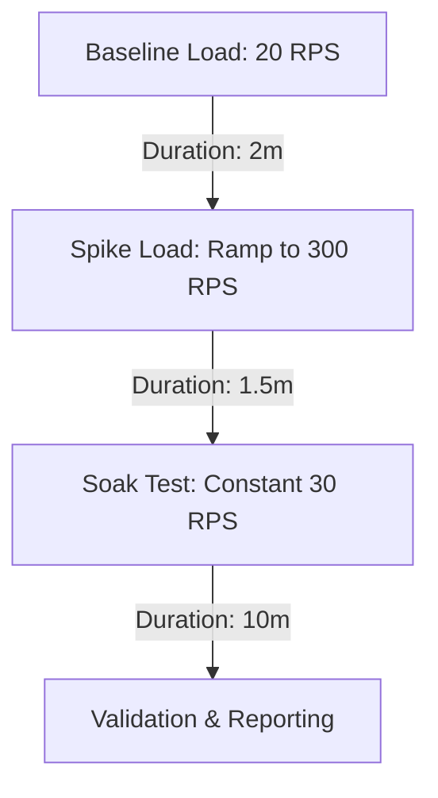

# Stress Test Plan — 50-Hospital Capacity Validation

This plan outlines the real-world metrics, mathematical models, and k6 configuration required to validate that a single instance of the OpenMRSenger rest-service can support **50 Dutch hospitals** (representing ~40% of all hospitals in the Netherlands) under baseline, peak, and recovery scenarios.

---

## 1. Traffic Projection Model

To model traffic generated by 50 average Dutch hospitals, we base our calculations on national outpatient healthcare averages:

### Baseline Constants
- **Hospitals in Scope**: 50
- **Average Outpatient Visits per Hospital / Year**: 450,000
- **Total Annual Appointments**: 50 × 450,000 = 22,500,000
- **Operational Days / Year**: 250 days (clinics operating Mon-Fri)
- **Daily Appointments**: 22,500,000 / 250 = 90,000 appointments/day
- **Average Webhooks per Appointment**: 1.5 (Initial scheduling + 0.5 updates/cancellations)
- **Total Daily Webhooks**: 90,000 × 1.5 = 135,000 webhooks/day

### Distribution & Peak Calculations
- **Clinic Operating Hours**: 8:00 AM to 5:00 PM (9 hours = 32,400 seconds)
- **Baseline Request Rate (Average)**: 
  $$\text{Baseline RPS} = \frac{135,000 \text{ requests}}{32,400 \text{ seconds}} \approx 4.17 \text{ req/s}$$
- **Peak Hour Surge (2.5x Multiplier)**:
  $$\text{Peak RPS} = 4.17 \text{ req/s} \times 2.5 \approx 10.43 \text{ req/s}$$
- **Worst-Case Synchronization Spike (Batch Imports / System Re-connects)**:
  - If 5 hospitals run simultaneous batch updates (e.g., syncing 3,000 appointments over a 1-minute window), it creates a burst:
  $$\text{Spike RPS} = \frac{5 \times 3,000}{60} = 250 \text{ req/s}$$

---

## 2. k6 Load Test Scenario Design

To simulate this traffic profile, the k6 test uses three sequential scenarios configured in [webhook-load-test.js](file:///E:/School/Avans/Jaar%202_ICT/2.4/repos/rest-service/monitoring/stress/webhook-load-test.js):



### Scenario Configuration Parameters
1. **Baseline Load (`baseline_load`)**
   - **Rate**: 20 RPS (Approx. 5x the average daily baseline of 4.17 req/s to include a safety margin).
   - **Duration**: 2 minutes.
2. **Spike Load (`spike_load`)**
   - **Ramp-up**: 0 to 300 RPS over 30 seconds (simulating massive concurrent batch synchronizations across hospitals).
   - **Steady State Peak**: 300 RPS held for 60 seconds.
   - **Ramp-down**: 300 to 20 RPS over 30 seconds.
3. **Soak Test (`soak_test`)**
   - **Rate**: 30 RPS (Approx. 3x the standard peak load of 10.43 req/s).
   - **Duration**: 10 minutes (to verify memory stability and connection pool integrity over time).

---

## 3. Execution Plan

### Step 1: Spin up the environment
Make sure the full Docker Compose stack is running with metrics enabled:
```bash
docker-compose up --build -d
```

### Step 2: Set credentials & environment variables
Create a shell script or set local environment variables before executing k6:
```powershell
$env:BASE_URL="http://localhost:8888"
$env:FAILURE_RATE="0.10" # Inject 10% failures to test retries & DLQ
$env:BASELINE_RPS="20"
$env:SPIKE_RPS="300"
$env:SOAK_RPS="30"
$env:SOAK_DURATION="10m"
```

### Step 3: Run the k6 load test
Execute the stress test script:
```bash
k6 run monitoring/stress/webhook-load-test.js
```

---

## 4. Acceptance Criteria & Validation Metrics

To prove the system handles 50 hospitals under this plan, the following metrics must be verified in Grafana or the k6 output:

| Metric | Target Value | Verification Source |
|--------|--------------|---------------------|
| **HTTP Request Success Rate** | > 99.9% (200 OK responses) | `http_req_failed` in k6 |
| **Response Latency (SLA)** | p95 < 1000ms (Baseline & Soak)| `http_req_duration` in k6 |
| **Response Latency (SLA)** | p95 < 3000ms (Spike)| `http_req_duration` in k6 |
| **Outbox Relay Integrity** | No lost messages, outbox queue drains | `rabbitmq_queue_messages` in Grafana |
| **Database Pool Stability** | Active connections < pool max (no exhaustion) | `hikaricp_connections_active` in Grafana |
| **JVM Memory Usage** | Heap consumption stabilizes (no memory leaks) | `jvm_memory_used_bytes` in Grafana |
| **Retry & DLQ Routing** | Injected failures enter retry queues and DLQ without affecting main queue | DLQ and retry queue sizes in Grafana |
